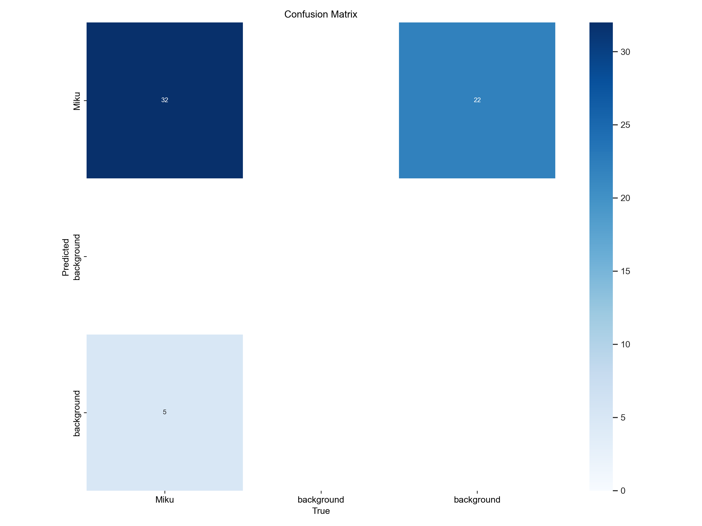
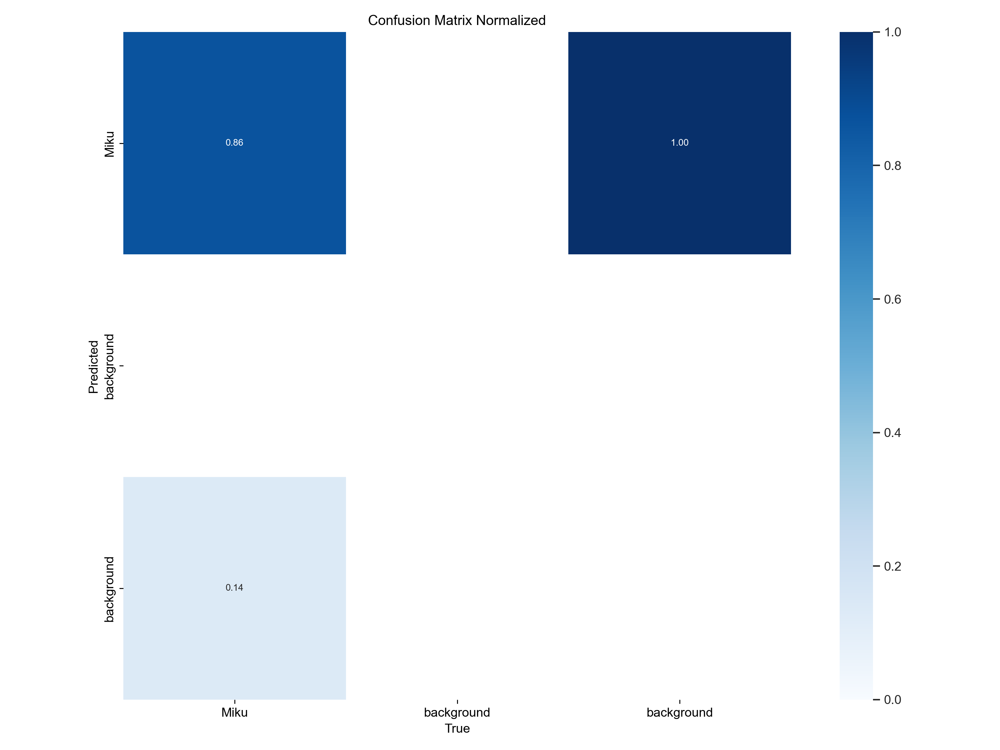
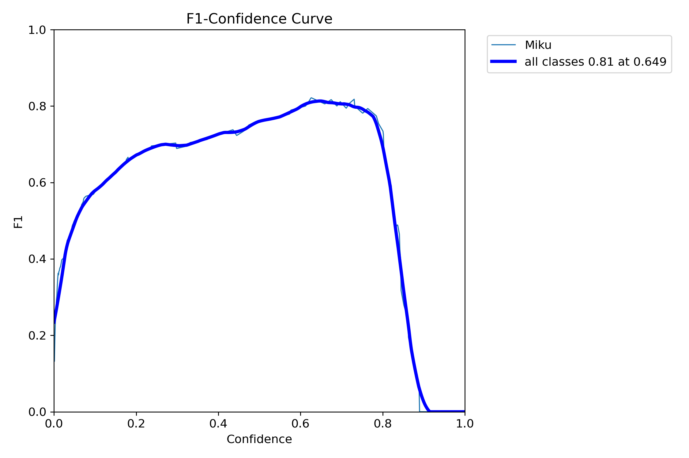
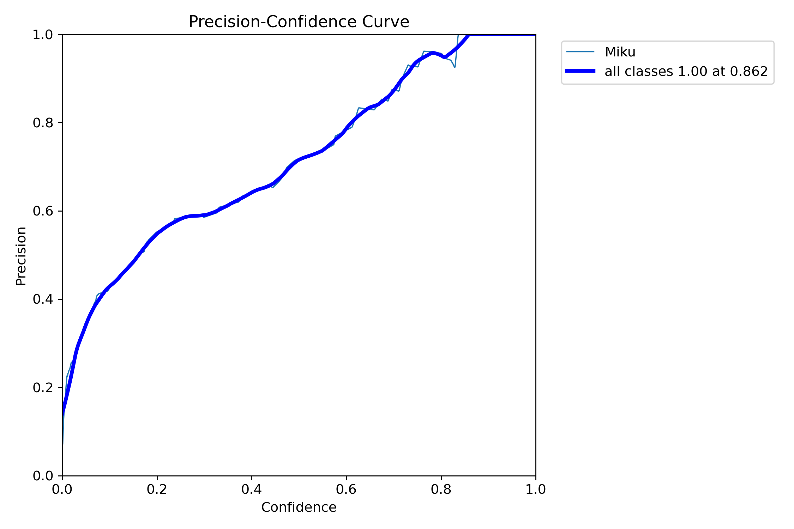
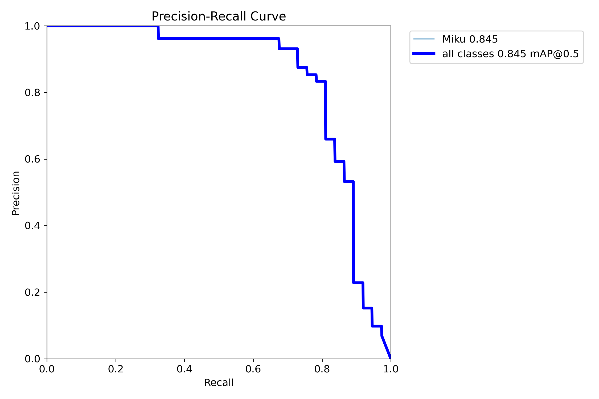
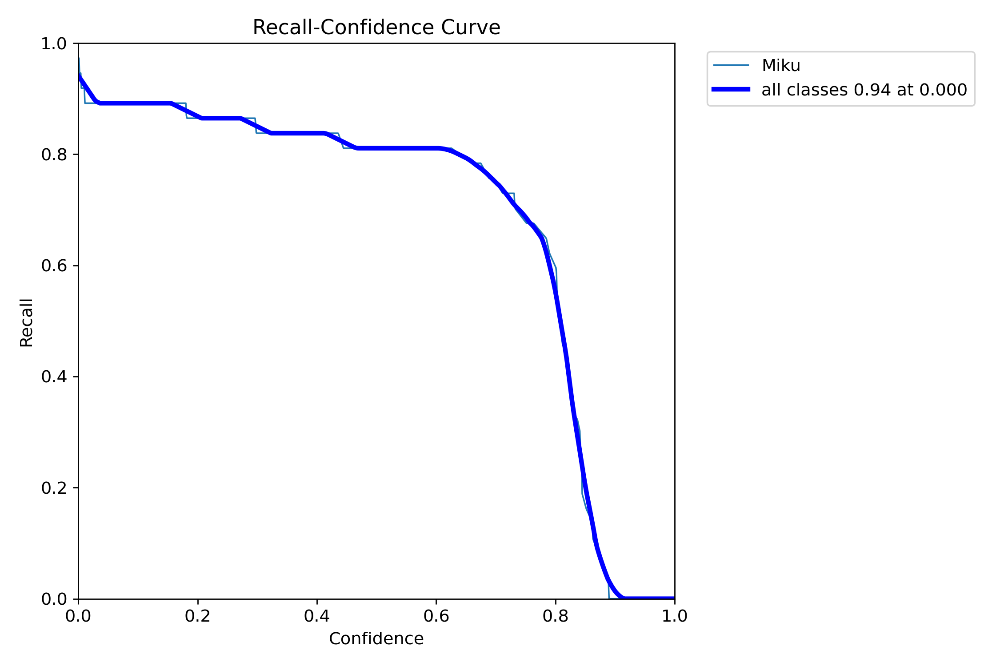

# Miku Detector

## Detects Miku, literally.
The code in this repository is a simple streamlit WebUI for you to play with Miku Detector.  

Go to [this link](https://mikudet.finalappr.dev) to try the demo!
# Model performance information  

